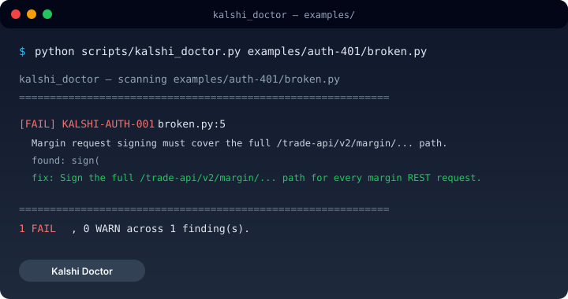

# Kalshi Doctor

**Catch broken Kalshi API integrations before your bot reaches production.**

*The public identity for the [`kalshi-api-engineering`](https://github.com/blakee-marcus/kalshi-api-engineering) agent skill.*


[](https://github.com/blakee-marcus/kalshi-api-engineering/actions/workflows/verify.yml)
[](LICENSE)
[](https://docs.kalshi.com/)
[](https://skills.sh/blakee-marcus/kalshi-api-engineering)

**Discoverable on:** [Claude Code](https://www.skills.sh/agent/claude-code) · [Cursor](https://www.skills.sh/agent/cursor) · [Codex](https://www.skills.sh/agent/codex) · [GitHub Copilot](https://www.skills.sh/agent/github-copilot)

```bash
npx skills add blakee-marcus/kalshi-api-engineering
```

Then ask your agent:

> **Audit this Kalshi integration.**

Or try the deterministic checker without any Kalshi credentials:

```bash
git clone https://github.com/blakee-marcus/kalshi-api-engineering.git
cd kalshi-api-engineering
python3 scripts/kalshi_doctor.py examples/auth-401/broken.py
```



---

## What it catches

AI-generated Kalshi clients usually *look* correct, then fail in a handful of
predictable ways. The skill turns those failures into a checklist the agent
runs before you ship:

| Bug | Consequence | Rule |
| --- | ----------- | ---- |
| Missing `/margin` in the signed REST path | Private calls 401 while public calls 200 | `KALSHI-AUTH-001` |
| Treating fixed-point `*_dollars` as cents | 100× pricing error | `KALSHI-PRICE-001` |
| Reusing the Predictions WebSocket auth path for Perps | Silent auth failure | `KALSHI-WS-001` |
| Continuing to trade through a sequence gap | Stale orderbook treated as trustworthy | `KALSHI-WS-003` |
| Expecting non-existent Perps channels (`market_lifecycle_v2`, `market_positions`) | Worker waits forever | `KALSHI-PERPS-001/002` |

The skill ships an **experimental deterministic checker** (`scripts/kalshi_doctor.py`)
with 12 heuristic rules that scan your client code and report `PASS` / `WARN` /
`FAIL` with file:line, the official Kalshi source each rule is *derived* from,
and a suggested fix. The rules are whole-file pattern checks, not semantic
analysis — they catch the common mistakes above with good recall, but can miss
nuanced cases and can flag clean code. Treat findings as review prompts, not
verdicts.

Every rule is *derived* from the **official Kalshi specification** (not a private
bot or personal notes); a scheduled check re-verifies the specs haven't drifted
against the committed baseline in `references/source-manifest.md`.

---

## Try it without credentials

No Kalshi account, no API key, no wallet:

```bash
python3 scripts/kalshi_doctor.py examples/
```

The checker deliberately scans the broken example files and prints the rules
you would see on a real client:

```text
kalshi_doctor — scanning examples/
============================================================

  [FAIL] KALSHI-AUTH-001  auth-401/broken.py:5
         Margin request signing must cover the full /trade-api/v2/margin/... path.
         fix: Sign the full /trade-api/v2/margin/... path for every margin REST request.

  [FAIL] KALSHI-PRICE-001  perps-fixed-point/broken.py:2
         Fixed-point prices are already 4-decimal strings; dividing by 100 underprices 100x.
         fix: Parse Decimal(price_dollars) verbatim; do NOT divide by 100.

  [WARN] KALSHI-WS-003  ws-sequence-gap/broken.py:3
         A sequence gap must invalidate book trust and force a fresh snapshot.
         fix: On any sequence gap, mark the book UNTRUSTED and demand a fresh snapshot.

============================================================
  2 FAIL, 2 WARN across 4 finding(s).
```

Full runnable versions live in [`examples/`](examples/) — each with a `broken.py`,
`fixed.py`, and README.

---

## Installation

```bash
npx skills add blakee-marcus/kalshi-api-engineering
```

Manual (any framework): copy `SKILL.md` and `references/` into your skill dir.
The Python checker is optional; it runs anywhere Python 3.9+ runs.

---

## Command vocabulary

The skill is a small set of named playbooks. The exact slash-command prefix
(`/kalshi …`) depends on your runtime — the skill loads as `SKILL.md` +
`references/` and the agent routes to the matching playbook.

| Command | What it does |
| --- | --- |
| `audit` | Inspect an existing integration for protocol mistakes |
| `doctor` | Run the deterministic checker (`scripts/kalshi_doctor.py`) |
| `auth` | Diagnose signing / 401s |
| `market-data` | Orderbook + WebSocket correctness and trust-state review |
| `perps` | Build or debug Perps / Margin integration |
| `orders` | Order construction, reconciliation, cancel semantics |
| `source` | Resolve a claim against the current Kalshi docs/specs |

---

## Quick start (read-only, optional)

If you already have a Kalshi demo key, this proves a signed margin `GET` works:

```python
import time, base64, requests
from cryptography.hazmat.primitives import hashes, serialization
from cryptography.hazmat.primitives.asymmetric import padding

KEY_ID, PEM_PATH = "YOUR_KEY_ID", "private_key.pem"
REST = "https://external-api.demo.kalshi.co/trade-api/v2"   # demo: safe read-only

def sign(method, path, key_path, body=None):
    ts = str(int(time.time() * 1000))
    if not path.startswith("/trade-api/v2"):
        path = f"/trade-api/v2{path}"
    msg = f"{ts}{method}{path.split('?')[0]}"
    if body: msg += body
    key = serialization.load_pem_private_key(open(key_path, "rb").read(), password=None)
    sig = key.sign(msg.encode(), padding.PSS(mgf=padding.MGF1(hashes.SHA256()),
                  salt_length=padding.PSS.DIGEST_LENGTH), hashes.SHA256())
    return {"KALSHI-ACCESS-KEY": KEY_ID,
            "KALSHI-ACCESS-SIGNATURE": base64.b64encode(sig).decode(),
            "KALSHI-ACCESS-TIMESTAMP": ts}

r = requests.get(f"{REST}/margin/balance", headers=sign("GET", "/margin/balance", PEM_PATH))
print(r.status_code)  # 200 = signature accepted
```

This skill **never places, amends, or cancels live orders**. Every example is a
read-only `GET`. CI fails if `README.md` or `SKILL.md` embeds a state-changing call.

---

## Supported runtimes

| Runtime / surface | Status |
| ----------------- | ------ |
| Agent Skills (`npx skills add`) | Install + discovery verified in CI |
| Claude Code | Plugin manifest validated in CI |
| Codex / Cursor | Agent Skill format compatible |
| Hermes Agent | Loads and is actively maintained via Hermes |

Compatibility = the skill loads and routes; it does not imply a harness-specific
integration was separately behavior-tested.

---

## Source grounding

Every reference page is derived from the **public Kalshi documentation**, not a
private bot or personal notes. See `references/api-documentation-index.md` and
`references/source-manifest.md` (per-page source URL + ingest date).

| Authority | Source |
| --- | --- |
| Docs home | https://docs.kalshi.com/ |
| Predictions REST | https://docs.kalshi.com/openapi.yaml |
| Perps / Margin REST | https://docs.kalshi.com/perps_openapi.yaml |
| Predictions / Perps WS | asyncapi.yaml / perps_asyncapi.yaml |

A scheduled GitHub Action hashes the official specs against the committed baseline
and opens an issue when they change, flagging references that may need maintainer review.

---

## Safety

- No autonomous trading or account mutation. Repository tooling may perform read-only documentation/network checks and update local maintenance state.
- No live-trading authorization; any state-changing call needs explicit user authorization + an execution boundary outside this skill.
- See [SECURITY.md](SECURITY.md).

---

## What's new

- **v0.2.1** — Drift monitor baseline fixed; checker claims softened to "experimental deterministic lint"; packaging parity with reference skills.
- **v0.2.0** — Deterministic checker with 12 rules, pytest fixtures, command vocabulary, upstream drift monitor, examples.
- **v0.1.0** — Public-trust reset: MIT license, read-only demo quickstart, source-backed references.

[Full changelog →](CHANGELOG.md)

---

## Contributing

Good first contributions:

- Add a regression fixture for a real Kalshi API failure.
- Add a checker rule backed by an official spec.
- Report docs/spec drift via the issue templates.

See [CONTRIBUTING.md](CONTRIBUTING.md).

---

## License

MIT — see [LICENSE](LICENSE).
